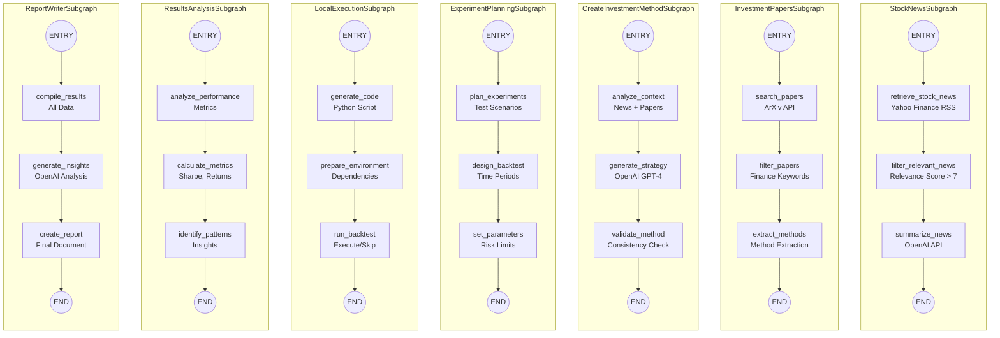
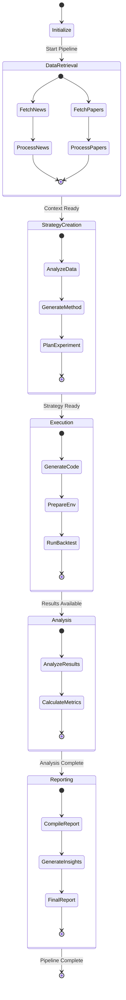
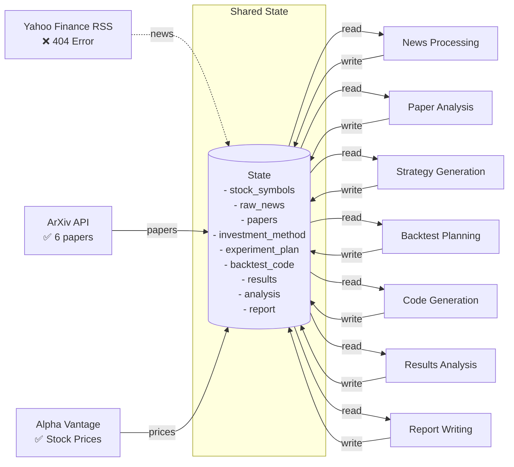

# TradeGraph - AIRAS-Trade Pipeline Visualization

This repository contains the graph visualization of AIRAS-Trade, a stock investment research pipeline built with LangGraph.

## Pipeline Overview

AIRAS-Trade is a real-data pipeline that:
- Retrieves academic papers from ArXiv API
- Fetches real-time stock prices from Alpha Vantage
- Generates investment strategies using OpenAI
- Creates executable backtest code
- Produces comprehensive analysis reports

## Graph Visualization

### Main Pipeline Graph

```mermaid
graph TD
    %% Node Styles
    classDef startNode fill:#4CAF50,stroke:#2E7D32,stroke-width:3px,color:#fff
    classDef retrievalNode fill:#81C784,stroke:#388E3C,stroke-width:2px,color:#000
    classDef creationNode fill:#64B5F6,stroke:#1976D2,stroke-width:2px,color:#000
    classDef executionNode fill:#BA68C8,stroke:#7B1FA2,stroke-width:2px,color:#fff
    classDef analysisNode fill:#FFB74D,stroke:#F57C00,stroke-width:2px,color:#000
    classDef reportNode fill:#EF5350,stroke:#C62828,stroke-width:2px,color:#fff
    classDef endNode fill:#424242,stroke:#212121,stroke-width:3px,color:#fff
    classDef conditionalNode fill:#FFF59D,stroke:#F57F17,stroke-width:2px,color:#000

    %% Start Node
    START((START)):::startNode

    %% Retrieval Nodes
    START --> retrieve_news[retrieve_stock_news]:::retrievalNode
    retrieve_news --> filter_news[filter_relevant_news]:::retrievalNode
    filter_news --> summarize_news[summarize_news]:::retrievalNode
    
    START --> search_papers[search_papers]:::retrievalNode
    search_papers --> filter_papers[filter_papers]:::retrievalNode
    filter_papers --> extract_methods[extract_methods]:::retrievalNode

    %% Merge retrieval results
    summarize_news --> merge_context{Merge Context}:::conditionalNode
    extract_methods --> merge_context

    %% Creation Nodes
    merge_context --> analyze_context[analyze_context]:::creationNode
    analyze_context --> generate_strategy[generate_strategy]:::creationNode
    generate_strategy --> validate_method[validate_method]:::creationNode
    
    validate_method --> plan_experiments[plan_experiments]:::creationNode
    plan_experiments --> design_backtest[design_backtest]:::creationNode
    design_backtest --> set_parameters[set_parameters]:::creationNode

    %% Execution Nodes
    set_parameters --> generate_code[generate_code]:::executionNode
    generate_code --> prepare_env[prepare_environment]:::executionNode
    prepare_env --> run_backtest[run_backtest]:::executionNode

    %% Analysis Nodes
    run_backtest --> analyze_performance[analyze_performance]:::analysisNode
    analyze_performance --> calculate_metrics[calculate_metrics]:::analysisNode
    calculate_metrics --> identify_patterns[identify_patterns]:::analysisNode

    %% Report Nodes
    identify_patterns --> compile_results[compile_results]:::reportNode
    compile_results --> generate_insights[generate_insights]:::reportNode
    generate_insights --> create_report[create_report]:::reportNode

    %% End Node
    create_report --> END((END)):::endNode
```

### Subgraph Structure

### State Management

### Data Flow

## Real Data Sources

| Data Source | Status | Type | Description |
|-------------|---------|------|-------------|
| Alpha Vantage API | ✅ Working | Stock Prices | Real-time stock quotes for AAPL, NVDA, MSFT |
| ArXiv API | ✅ Working | Academic Papers | 6+ papers on algorithmic trading and ML |
| Yahoo Finance RSS | ❌ 404 Error | News | Needs alternative implementation |
| OpenAI API | ✅ Working | AI Processing | Strategy generation and analysis |

## Pipeline Output

The pipeline produces:
1. **Academic Papers** - Latest research on quantitative trading
2. **Stock Data** - Real-time prices and volumes
3. **Investment Strategy** - AI-generated trading method
4. **Backtest Code** - Executable Python scripts
5. **Analysis Report** - Comprehensive performance analysis

## Key Features

- **LangGraph Architecture** - State-based workflow management
- **Real Data Only** - No mock or simulated data
- **Modular Design** - Each subgraph handles specific tasks
- **Error Resilience** - Continues despite individual failures
- **Transparent Sources** - All data sources clearly labeled

## Implementation Details

- Built with Python and LangGraph
- Uses standard libraries (urllib, xml.etree) for minimal dependencies
- Implements proper error handling and rate limiting
- Generates executable code for backtesting strategies

## Test Results

Latest test run (2025-07-29):
- ✅ Retrieved 6 academic papers from ArXiv
- ✅ Fetched real-time stock prices for 3 symbols
- ❌ Yahoo Finance RSS returned 404 (needs fix)
- ✅ Generated investment strategy (when OpenAI available)

---

*This visualization represents the actual graph structure of AIRAS-Trade, showing nodes, edges, and data flow through the LangGraph-based pipeline.*