# TradeGraph

TradeGraph is a stock investment research pipeline built with LangGraph that uses real data sources to analyze markets, generate trading strategies, and produce comprehensive investment reports.

## 🚀 Quick Start

```bash
# Clone the repository
git clone https://github.com/wkumagai/TradeGraph.git
cd TradeGraph

# Install dependencies
pip install -r requirements.txt

# Set up API keys in .env file
OPENAI_API_KEY=your_key_here
ALPHAVANTAGE_API_KEY=your_key_here

# Run the complete pipeline
python subgraphs/examples/run_complete_pipeline.py

# Or run individual subgraphs
python subgraphs/01_stock_news/examples/run_stock_news.py
python subgraphs/02_investment_papers/examples/run_paper_search.py
```

## 📁 Project Structure

```
TradeGraph/
├── src/tradegraph/          # Core implementation
├── subgraphs/              # Modular pipeline components
│   ├── 01_stock_news/      # News retrieval
│   ├── 02_investment_papers/   # Academic paper search
│   ├── 03_create_investment_method/  # Strategy generation
│   ├── 04_experiment_planning/  # Backtest design
│   ├── 05_local_execution/     # Code generation
│   ├── 06_results_analysis/    # Performance analysis
│   ├── 07_report_writer/       # Report generation
│   └── examples/           # Pipeline examples
├── requirements.txt        # Python dependencies
└── README.md              # This file
```

## 🔗 Subgraph Documentation

Each subgraph has its own documentation:
- [Stock News](subgraphs/01_stock_news/README.md) - Market news retrieval
- [Investment Papers](subgraphs/02_investment_papers/README.md) - ArXiv paper search
- [Create Method](subgraphs/03_create_investment_method/README.md) - AI strategy generation
- [Experiment Planning](subgraphs/04_experiment_planning/README.md) - Backtest configuration
- [Local Execution](subgraphs/05_local_execution/README.md) - Code generation/execution
- [Results Analysis](subgraphs/06_results_analysis/README.md) - Performance metrics
- [Report Writer](subgraphs/07_report_writer/README.md) - Final report generation

See [Architecture Documentation](subgraphs/ARCHITECTURE.md) for detailed system design.

## Main Pipeline Graph (High-Level)

This graph shows the connections between subgraphs:

```mermaid
graph TD
    %% Styles for subgraphs
    classDef subgraphNode fill:#E3F2FD,stroke:#1565C0,stroke-width:3px,color:#000
    classDef startEnd fill:#4CAF50,stroke:#2E7D32,stroke-width:3px,color:#fff
    classDef stateNode fill:#FFD700,stroke:#F57F17,stroke-width:3px,color:#000

    %% Nodes
    START((START)):::startEnd
    State[("Shared State<br/>━━━━━━━━━━<br/>stock_symbols<br/>raw_news<br/>papers<br/>investment_method<br/>results")]:::stateNode
    END((END)):::startEnd
    
    %% Subgraph nodes
    SN[StockNewsSubgraph]:::subgraphNode
    IP[InvestmentPapersSubgraph]:::subgraphNode
    CIM[CreateInvestmentMethodSubgraph]:::subgraphNode
    EP[ExperimentPlanningSubgraph]:::subgraphNode
    LE[LocalExecutionSubgraph]:::subgraphNode
    RA[ResultsAnalysisSubgraph]:::subgraphNode
    RW[ReportWriterSubgraph]:::subgraphNode
    
    %% Main flow
    START --> SN
    START --> IP
    SN --> State
    IP --> State
    State --> CIM
    CIM --> EP
    EP --> LE
    LE --> RA
    RA --> RW
    RW --> END
    
    %% State connections
    CIM -.->|save method| State
    RA -.->|read all data| State
```



## Detailed Subgraph Structures

### 1. StockNewsSubgraph


### 2. InvestmentPapersSubgraph

```mermaid
graph TD
    classDef retrievalNode fill:#81C784,stroke:#388E3C,stroke-width:2px,color:#000
    classDef processNode fill:#AED581,stroke:#689F38,stroke-width:2px,color:#000
    classDef dataSource fill:#E8F5E9,stroke:#4CAF50,stroke-width:1px,color:#1B5E20
    
    subgraph "InvestmentPapersSubgraph"
        START2((ENTRY))
        END2((END))
        
        %% Nodes
        P1[search_papers]:::retrievalNode
        P2[filter_papers]:::processNode
        P3[extract_methods]:::processNode
        
        %% Data source
        DS2[ArXiv API<br/>✅ Working]:::dataSource
        
        %% Flow
        START2 --> P1
        DS2 -.-> P1
        P1 --> P2
        P2 --> P3
        P3 --> END2
        
        %% Node details
        P1 -.-> |"Query: ML trading<br/>portfolio optimization<br/>quant finance"| P1
        P2 -.-> |"Finance keywords<br/>q-fin categories"| P2
        P3 -.-> |"Extract trading<br/>strategies"| P3
    end
```



### 3. CreateInvestmentMethodSubgraph


### 4. ExperimentPlanningSubgraph


### 5. LocalExecutionSubgraph


### 6. ResultsAnalysisSubgraph


### 7. ReportWriterSubgraph


## Data Flow Summary

```mermaid
graph LR
    subgraph "External Data Sources"
        E1[Alpha Vantage API<br/>✅ Stock Prices]
        E2[ArXiv API<br/>✅ Papers]
        E3[Yahoo RSS<br/>❌ News]
        E4[OpenAI API<br/>✅ AI]
    end
    
    subgraph "Pipeline Processing"
        P1[Data Retrieval]
        P2[Strategy Creation]
        P3[Execution]
        P4[Analysis & Report]
    end
    
    E1 --> P1
    E2 --> P1
    E3 -.-> P1
    E4 --> P2
    E4 --> P4
    
    P1 --> P2
    P2 --> P3
    P3 --> P4
```



## Pipeline Status

| Subgraph | Status | Data Source | Output |
|----------|---------|------------|---------|
| StockNewsSubgraph | ⚠️ Needs Fix | Yahoo RSS (404) | News summaries |
| InvestmentPapersSubgraph | ✅ Working | ArXiv API | 6+ papers |
| CreateInvestmentMethodSubgraph | ✅ Working | OpenAI API | Trading strategy |
| ExperimentPlanningSubgraph | ✅ Working | Internal logic | Backtest plan |
| LocalExecutionSubgraph | ✅ Working | Python generation | Executable code |
| ResultsAnalysisSubgraph | ✅ Working | Metrics calculation | Performance stats |
| ReportWriterSubgraph | ✅ Working | OpenAI API | Final report |

## Key Features

- **Hierarchical Structure**: Main graph shows subgraph connections, detailed views show internal nodes
- **Real Data Sources**: All external data is real (no mocks)
- **LangGraph Architecture**: State-based workflow with shared memory
- **Error Resilience**: Pipeline continues despite individual failures
- **Transparent Processing**: Each step clearly shows its data source and processing

---

*This visualization represents the complete hierarchical structure of AIRAS-Trade, from high-level subgraph connections down to individual processing nodes.*
