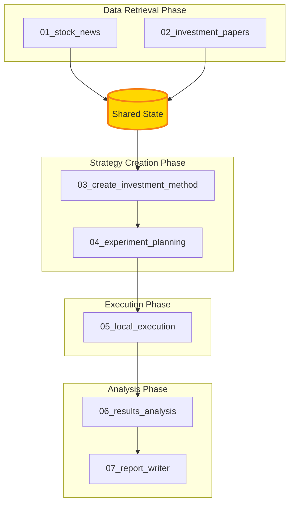

# TradeGraph Subgraph Architecture

## Directory Structure

```
TradeGraph/
├── subgraphs/                    # Modular subgraph components
│   ├── README.md                 # Architecture overview
│   ├── ARCHITECTURE.md           # This file
│   ├── examples/                 # Cross-subgraph examples
│   │   └── run_complete_pipeline.py
│   │
│   ├── 01_stock_news/           # News retrieval subgraph
│   │   ├── README.md
│   │   ├── src/                 # Source code
│   │   ├── tests/               # Unit tests
│   │   ├── examples/            # Usage examples
│   │   └── docs/                # Documentation
│   │
│   ├── 02_investment_papers/    # Paper search subgraph
│   │   └── (same structure)
│   │
│   ├── 03_create_investment_method/  # Strategy generation
│   │   └── (same structure)
│   │
│   ├── 04_experiment_planning/   # Backtest design
│   │   └── (same structure)
│   │
│   ├── 05_local_execution/       # Code generation/execution
│   │   └── (same structure)
│   │
│   ├── 06_results_analysis/      # Performance analysis
│   │   └── (same structure)
│   │
│   └── 07_report_writer/         # Report generation
│       └── (same structure)
│
└── src/tradegraph/              # Core implementation
    └── features/
        └── stock_research/      # Current implementation
```

## Data Flow Architecture



## Subgraph Communication

Each subgraph communicates through a shared state dictionary:

```python
state = {
    # Input
    "stock_symbols": ["AAPL", "GOOGL"],
    
    # From 01_stock_news
    "raw_news": [...],
    "filtered_news": [...],
    "news_summary": "...",
    
    # From 02_investment_papers
    "papers": [...],
    
    # From 03_create_investment_method
    "investment_method": {...},
    
    # From 04_experiment_planning
    "experiment_plan": {...},
    
    # From 05_local_execution
    "generated_code": "...",
    "backtest_results": {...},
    
    # From 06_results_analysis
    "analysis_results": {...},
    
    # From 07_report_writer
    "final_report": "..."
}
```

## Benefits of Subgraph Architecture

1. **Modularity**: Each subgraph is independent and can be:
   - Developed separately
   - Tested in isolation
   - Replaced with alternatives
   - Reused in other pipelines

2. **Scalability**: Subgraphs can be:
   - Deployed as microservices
   - Run in parallel (for data retrieval)
   - Distributed across machines

3. **Maintainability**: Clear separation of concerns:
   - Each subgraph has one responsibility
   - Easy to debug specific stages
   - Simple to add new features

4. **Flexibility**: Pipeline can be customized:
   - Skip stages if needed
   - Run partial pipelines
   - Add custom subgraphs

## Running Individual Subgraphs

Each subgraph can be run independently:

```bash
# Run just news retrieval
python subgraphs/01_stock_news/examples/run_stock_news.py

# Run just paper search
python subgraphs/02_investment_papers/examples/run_paper_search.py

# Run complete pipeline
python subgraphs/examples/run_complete_pipeline.py
```

## Adding New Subgraphs

To add a new subgraph:

1. Create directory: `subgraphs/XX_new_feature/`
2. Add standard structure (src, tests, examples, docs)
3. Implement the subgraph class extending `BaseSubgraph`
4. Define input/output state keys
5. Update the pipeline to include the new stage

## Testing Strategy

Each subgraph should have:
- Unit tests for individual nodes
- Integration tests for the full subgraph
- Mock data for testing without external APIs
- Performance benchmarks