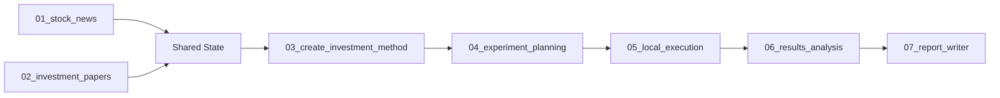

# TradeGraph Subgraph Architecture

TradeGraph is organized into 7 sequential subgraphs that form a complete investment research pipeline.

## Pipeline Flow



## Subgraph Overview

### 1. Stock News Subgraph
- **Purpose**: Retrieve current market news
- **Data Source**: Yahoo Finance RSS (needs fix)
- **Output**: Filtered and summarized news

### 2. Investment Papers Subgraph  
- **Purpose**: Find academic trading research
- **Data Source**: ArXiv API ✅
- **Output**: 6-10 relevant papers

### 3. Create Investment Method Subgraph
- **Purpose**: Generate AI trading strategy
- **Data Source**: OpenAI GPT-4 ✅
- **Output**: Complete strategy specification

### 4. Experiment Planning Subgraph
- **Purpose**: Design backtest parameters
- **Processing**: Internal logic
- **Output**: Test configuration

### 5. Local Execution Subgraph
- **Purpose**: Generate/run backtest code
- **Processing**: Python code generation
- **Output**: Executable script or results

### 6. Results Analysis Subgraph
- **Purpose**: Analyze performance metrics
- **Processing**: Statistical analysis
- **Output**: Performance insights

### 7. Report Writer Subgraph
- **Purpose**: Create final report
- **Data Source**: OpenAI API ✅
- **Output**: Comprehensive document

## Shared State

All subgraphs communicate through a shared state containing:
- `stock_symbols`: Target stocks
- `raw_news`: All retrieved news
- `papers`: Academic papers
- `investment_method`: Generated strategy
- `backtest_results`: Performance data
- `analysis_results`: Insights
- `final_report`: Complete report

## Running the Pipeline

Each subgraph can be run independently or as part of the complete pipeline:

```python
# Run complete pipeline
from tradegraph import run_pipeline
results = run_pipeline(["AAPL", "GOOGL", "MSFT"])

# Run individual subgraph
from tradegraph.features.stock_research import StockNewsSubgraph
news_graph = StockNewsSubgraph()
news_results = news_graph.run({"stock_symbols": ["AAPL"]})
```

## Directory Structure

Each subgraph directory contains:
- `README.md` - Subgraph documentation
- `src/` - Source code
- `tests/` - Unit tests
- `examples/` - Usage examples
- `docs/` - Additional documentation